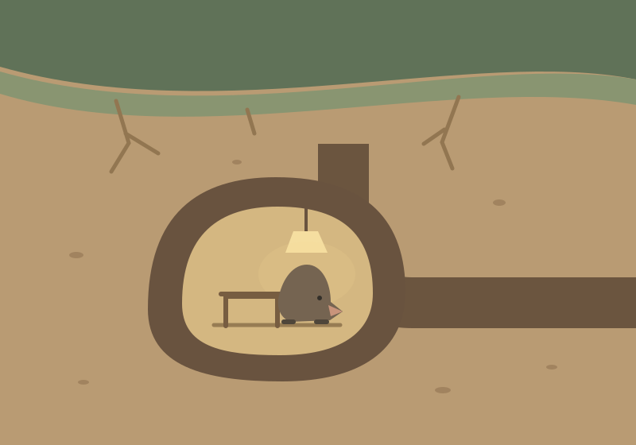

# Fiabe

Fiabe della buonanotte dal prato ai piedi della collina. Ogni personaggio ha il
suo libro, e i libri stanno su uno scaffale: la pagina iniziale li elenca, e
ognuno si legge per conto suo.

| | Libro | Stato |
| --- | --- | --- |
| I | **Le fiabe di Nina** — la lucciola | 10 fiabe, un prologo e un epilogo |
| II | **Le fiabe di Tilde** — la vecchia talpa | 12 fiabe, un prologo e un epilogo |

Tilde compare già nelle fiabe di Nina: è «la vecchia talpa che non trovava mai
la porta di casa», nominata tre volte come una battuta ricorrente. Il suo libro
sta sotto il prato e corre lungo gli stessi anni, quindi ogni tanto i due libri
raccontano la stessa notte da due parti diverse.

## Le fiabe di Nina


| | Titolo | Lettura ad alta voce |
|---|---|---|
| — | Prologo | 4 min |
| I | La lucciola che aveva paura del buio | 3 min |
| II | La lucciola e la lanterna stanca | 5 min |
| III | La lucciola e la piccola che non voleva accendersi | 6 min |
| IV | La lucciola e il grillo che perse la voce | 9 min |
| V | La lucciola e la luce nella finestra | 6 min |
| VI | La lucciola e chi scese dalla collina | 6 min |
| VII | La lucciola e il grillo che volò | 7 min |
| VIII | La lucciola che restò sulla radice | 7 min |
| IX | La lucciola che raccontava | 7 min |
| X | La lucciola che ascoltò la sua storia | 8 min |
| — | Epilogo | 4 min |

Vanno letti in ordine: il primo accende la luce, il secondo la spegne, il terzo
scopre che la luce di un altro non si può accendere, il quarto insegna che ciò
che si è donato resta in chi ci è stato vicino. Il quinto porta Nina fuori dal
prato per la prima volta, e le fa scoprire chi c'è dall'altra parte; nel sesto
è l'altra parte che scende nel prato, e deve imparare da capo la lezione del
terzo — che certe cose non si vanno a prendere, si aspettano. Il settimo chiude
la storia di Rocco, e riprende la promessa fatta nel quarto: la canzone resta
in chi l'ha sentita. L'ottavo rifà il secondo con i ruoli scambiati: stavolta
è Bea a spegnersi, e Nina a dire le parole che una volta le aveva detto Rocco.
Nel nono le ali non la portano più, e le lucciole nuove — che Rocco non l'hanno
mai conosciuto — vanno da lei a farsi raccontare le otto fiabe di prima. Nel
decimo è Bea che racconta, e chi ascolta è Nina — che poi passa la siepe e se ne
va verso la terra asciutta, dove c'è più buio che in qualunque altro posto e
nessuno sa accendersi. Non torna, ma nessuno la vede spegnersi: la fine è aperta
apposta, e la canzone che il prato canta ogni sera serve anche a farle sapere da
che parte è casa.

Il **Prologo** si legge per primo ed è scritto per ultimo: non racconta il prato,
racconta chi lo guardava dalla finestra. È quella persona a dire «amore mio»
nella chiusa di tutte e dieci le fiabe.

L'**Epilogo** si legge alla fine e risponde all'unica domanda che i bambini
fanno sempre — *ma è vera?* — separando quello che è vero davvero (il prato, la
quercia, le lucciole, i grilli, il buio, la paura del buio) da quello che è
stato aggiunto: il nome di Nina. Poi smette di raccontare e porta chi ascolta
alla finestra, al buio, ad aspettare. La serie finisce facendo fare la cosa di
cui ha parlato per dieci sere.

Prologo ed Epilogo prendono i numeri `00` e `11` e non consumano un numero
romano: nell'indice sono «Prologo» ed «Epilogo», e le loro ancore sono
`#prologo` e `#epilogo`.

Il settimo è l'unico in cui muore qualcuno. Muore di vecchiaia, nel sonno, dopo
aver avuto quello che voleva, e la fiaba non finisce lì — ma è bene saperlo
prima di leggerlo ad alta voce a qualcuno che si è affezionato a Rocco.

Nel decimo Nina se ne va e non torna. Se sia la stessa cosa la fiaba non lo dice,
e l'Epilogo nemmeno: chi ascolta può tenersi la porta aperta quanto vuole.

### Personaggi

- **Nina** — la lucciola protagonista. Aveva paura del buio da piccola; impara
  ad accendersi per salvare un grillo perduto, e passa il resto della vita
  imparando quando accendersi, quando spegnersi, e quando lasciare che sia
  un'altra a farlo da sola.
- **Rocco** — il grillo che Nina salva nel primo libro. Diventano amici per
  tutta la vita: canta ogni sera per il prato, perde la voce da vecchio
  (Libro IV), e muore nel sonno nel Libro settimo, dopo aver visto un'ultima
  volta il prato acceso.
- **Bea** — una lucciola piccola che all'inizio non riesce ad accendersi
  (Libro III); Nina la aiuta come Rocco aveva aiutato lei. Cresce, diventa una
  guida per tutto il prato, e nel Libro ottavo è la sua luce a spegnersi —
  stavolta è Nina a ritrovarla al buio.
- **Chi scese dalla collina** — non ha un nome nelle fiabe di Nina; nel
  Libro undicesimo di Tilde una lucciola parla di «una persona piccola».
  È chi abitava nella casa in cima alla collina, la stessa voce che racconta
  tutte le fiabe da grande. Nel Libro sesto scende a vedere il prato acceso
  da vicino. Il genere di questa persona non è specificato.
- **Le lucciole nuove** — le generazioni che non hanno mai conosciuto Rocco,
  ma cantano ancora la sua canzone senza sapere perché; nel Libro nono lo
  chiedono a Nina, e lei gliela racconta.

## Le fiabe di Tilde



| | Titolo | Lettura ad alta voce |
|---|---|---|
| — | Prologo | 4 min |
| I | La talpa che non trovava la porta di casa | 7 min |
| II | Le strade sotto il prato | 7 min |
| III | Sette | 5 min |
| IV | Il vicino di sopra | 5 min |
| V | L'acqua | 6 min |
| VI | Quelli di sopra | 6 min |
| VII | La stanza che non c'è più | 5 min |
| VIII | Il canto che si è fermato | 6 min |
| IX | Scavare in avanti | 6 min |
| X | La città di prima | 7 min |
| XI | Sette esce | 9 min |
| XII | La porta di casa | 7 min |
| — | Epilogo | 5 min |

Nina guarda il prato da sopra e parla di luce: farsi vedere, rendersi utili,
avere il permesso di smettere. Tilde lo guarda da sotto e parla di un'altra
cosa — sapere dove sei. Il libro corre lungo gli stessi anni di quello di Nina,
e alcuni capitoli raccontano la stessa notte dall'altra parte: il quarto è
l'estate in cui Rocco canta tutte le notti (Libro secondo di Nina, ma sotto è
una vibrazione nel pavimento, non un suono); il sesto è la finestra gialla che
per chi sta sopra è meraviglia e per chi sta sotto è il momento in cui l'acqua
cambia strada; l'ottavo è la notte in cui il canto si ferma, vista dal
soffitto invece che dall'erba; l'undicesimo è la notte del prato tutto acceso,
vista da chi non può vederlo.

Il libro di Tilde non è la storia di una vita, come quello di Nina: lei è già
vecchia al primo capitolo e lo resta. È un cantiere — un problema che comincia,
peggiora e si risolve scavando. Il motore è l'acqua: quando in cima alla
collina scavano un pozzo per la casa, l'acqua sotto il prato cambia strada, e
per Tilde è un piccolo terremoto lento che regge i capitoli V–X. Chi ha
costruito quella casa non è il cattivo della storia: il danno è vero, ma
nessuno lassù sa che il prato ha anche un sotto, e il libro non chiede a un
bambino di avere qualcuno da odiare — solo di capire che le persone buone
possono fare un male vero senza saperlo.

Vanno letti in ordine: il primo mostra che c'è sempre un posto in cui si è
bravissimi, anche se non è quello dove ti guardano tutti; il secondo insegna
che le cose lunghe non si vedono mentre succedono; il quarto lega Tilde e
Rocco con un rituale di tre colpetti sul soffitto che torna fino alla fine del
libro. Dal quinto al settimo l'acqua arriva, sposta le vicine di Tilde e le
allaga metà casa: non si può tappare, si può solo chiudere e ricominciare.
L'ottavo è il capitolo per cui il libro è stato costruito — Rocco perde la
voce, e Tilde gli scava di nascosto l'angolino di terra asciutta sotto la
radice della quercia che i lettori delle fiabe di Nina già conoscono, senza
sapere chi l'avesse fatto. Il nono e il decimo rifanno la casa: prima da capo,
una talpa al giorno, poi trovando una città intera scavata da talpe morte da
prima che Tilde nascesse, e imparando a viverci dentro senza cancellare quello
che hanno lasciato. L'undicesimo lascia andare Sette, la ninfa di cicala
cresciuta per sette anni nel terzo capitolo, in un posto dove Tilde non può
seguirla. Il dodicesimo chiude il libro: la casa nuova ha bisogno di una porta,
e Tilde la mette accanto al ricordo di Rocco — per la prima volta in vita sua
la trova al primo colpo, perché l'ha scelta lei.

Il **Prologo** usa la stessa voce di quello di Nina, ma fa un'ammissione che
l'altro non fa: il pozzo che ha cambiato la strada dell'acqua sotto il prato è
lo stesso della casa in cima alla collina, e la gente buona che ci abitava ha
fatto un danno vero senza saperlo. L'**Epilogo** chiude il cerchio con quello
di Nina — lì si diceva già che l'angolino di terra asciutta sotto la radice è
vero, senza dire chi l'avesse fatto; qui si dice chi, e cosa è stato fatto
(poco, e tardi, ma qualcosa) una volta scoperto il danno.

### Personaggi

- **Tilde** — la vecchia talpa protagonista. Sopra è una barzelletta — non
  trova mai la porta di casa — sotto è un ingegnere: conosce ogni corridoio,
  ogni radice, ogni cambiamento della terra sotto le zampe.
- **Pino** — un toporagno giovane, velocissimo e loquace, che deve mangiare
  ogni venti minuti o muore. Non è un allievo di Tilde: è un vicino invadente
  di cui lei finisce per non poter fare a meno.
- **Sette** — una ninfa di cicala che Tilde conosce da quando era grande come
  un chicco di riso. Resta ferma in una cella per sette anni prima di uscire
  con le ali nuove, e se ne va — forse per sempre.
- **Rocco** — lo stesso grillo delle fiabe di Nina, qui è «il vicino di
  sopra»: Tilde non lo sente cantare, lo sente vibrare nella terra, e per
  anni si parlano con tre colpetti sul soffitto.
- **La quercia** — non parla e non si muove che lei veda, ma le sue radici
  crescono un dito all'anno, e per Tilde sono la strada maestra di tutto il
  prato.

## Come ci si rivolge a chi ascolta

Ogni fiaba si chiude parlando direttamente a chi ascolta. La formula è
**«amore mio»**, scelta perché non ha genere: chi ascolta può essere chiunque.

Fino al Libro quinto la formula era «piccolo mio», sostituita ovunque nei testi.

Nelle fiabe di Tilde anche le altre frasi rivolte a chi ascolta e i riferimenti
alla voce narrante e alla persona della collina non ne specificano il genere,
in italiano e in inglese. Si usano riformulazioni naturali da leggere ad alta
voce, mantenendo il genere e l'identità dei personaggi Tilde, Pino, Rocco e Sette.

## L'audio (voce clonata)

Oltre alla pagina web, le fiabe possono essere ascoltate ad alta voce con una
**voce clonata** (la voce dell'autore). La clonazione è fatta con **ElevenLabs
Professional Voice Cloning** (piano Creator): voce `fiabe`
(`G9UYpVOtV3hbTUam453l`), italiano, accento romanesco.

Gli MP3 (`audio/11l-*.mp3`) sono versionati nel repository e compaiono come
lettori audio sulla pagina (`index.html`): ogni fiaba che ha il suo MP3 mostra un
riquadro "Ascolta" subito sotto il titolo.

Il numero dell'MP3 viene dal nome del file della fiaba, non dalla sua posizione:
`stories/it/nina/07….md` cerca `audio/nina/11l-07-*.mp3`. Per questo il Prologo ha potuto
prendere il numero `00` senza rinumerare niente.

Stato attuale: per **Nina**, Prologo, Libro X ed Epilogo non hanno ancora
l'audio, e i testi di IV, VI, VII, VIII e IX sono cambiati dopo la revisione,
quindi i loro MP3 vanno rifatti. I, II, III e V sono allineati. In una volta
sola:

```bash
python3 generate_elevenlabs.py nina 00 04 06 07 08 09 10 11
```

Per **Tilde** l'audio non è ancora stato registrato per nessun capitolo:

```bash
python3 generate_elevenlabs.py tilde
```

Il vecchio percorso locale con **Coqui TTS (XTTS-v2)** resta in `generate.py` come
alternativa gratuita, ma è stato sostituito da ElevenLabs perché la qualità della
clonazione era giudicata insufficiente. `generate_elevenlabs.py` è lo script che
chiama l'API ElevenLabs (richiede `ELEVENLABS_API_KEY` in `.env`).

Note:

- La voce clonata parte da un campione pulito (non un vocale WhatsApp compresso):
  il campione va registrato con l'app Memo Vocali a 128 kbps o più.
- Il modello XTTS-v2 (usato in `generate.py`) è distribuito con licenza
  **non-commerciale** (CPML); ElevenLabs non ha questa limitazione sul piano a pagamento.

## La pagina

`index.html` non si modifica a mano: è generato da `build.py` a partire dai file
`.md`. Dopo aver aggiunto o corretto una fiaba:

```bash
python3 build.py
```

Lo stile condiviso si modifica in `assets/fiabe.css`; le illustrazioni dello
scaffale sono `assets/meadow.svg` e `assets/burrow.svg`. Tutte le pagine usano
gli stessi asset, senza dipendenze di compilazione aggiuntive.

Lo script rilegge tutti i file `stories/<lingua>/<libro>/[0-9][0-9]*.md` in ordine e ricostruisce indice,
tempi di lettura e colophon. Per aggiungere una fiaba basta creare in `stories/`
in `stories/<lingua>/<libro>/` un file `NN<titolo-attaccato-minuscolo>.md` (`00` è il prologo) con la stessa
struttura degli altri:
titolo `#`, sottotitolo in corsivo, separatore `---`, paragrafi.

## Le lingue

Una cartella per lingua sotto `stories/`, e una pagina per lingua:

| Lingua | Testi | Scaffale | Un libro |
| --- | --- | --- | --- |
| Italiano | `stories/it/<libro>/` | `/` | `/nina/`, `/tilde/` |
| English (UK) | `stories/en-GB/<libro>/` | `/en/` | `/en/nina/`, `/en/tilde/` |

I libri stanno in `LIBRI`, in `build.py`, con titolo, riassunto e descrizione
(quella che va nel meta-tag e nell'anteprima social) per lingua. Un libro
senza file `.md` in una lingua non sparisce: compare sullo scaffale come
«in preparazione».

`build.py` genera tutte le lingue in `LINGUE`, dove stanno anche le stringhe
dell'interfaccia. Una lingua senza file `.md` viene saltata con un avviso, quindi
per aggiungerne una basta creare la cartella, tradurre e aggiungere la voce.

Le ancore non cambiano con la lingua: `#prologo`, `#libro-1` … `#libro-10`,
`#epilogo` sono le stesse su tutte le pagine.

I titoli inglesi seguono la stessa regola di quelli italiani, maiuscola solo
sulla prima parola. In inglese si userebbe anche il maiuscolo su tutte le
parole: è una scelta, non una dimenticanza.

L'audio è per ora solo italiano. `build.py` cerca gli MP3 di ogni lingua in
`audio/<libro>/` per l'italiano e in `audio/<lingua>/<libro>/` per le altre: la pagina inglese
semplicemente non mostra nessun riquadro "Ascolta".

I percorsi nelle pagine sono assoluti (`/audio/…`, `/en/`), quindi per
guardarle in locale serve un server, non basta aprire il file:

```bash
python3 -m http.server 8000
```

## Come si usa la pagina

Chi legge lo fa quasi sempre di sera, col telefono in mano e la luce bassa, una
fiaba per volta. La pagina tiene conto di questo:

- **Barra in basso**: compare quando si è dentro una fiaba, a portata di pollice,
  e rispetta l'area sicura del telefono. Da lì si torna all'indice, si cambia la
  dimensione del testo e si cambia il tema, senza dover risalire.
- **Comincia a leggere**: apre la prima storia direttamente; alla fine di ogni
  capitolo un collegamento porta al successivo, e alla fine del libro allo scaffale.
- **Riprendi**: ogni libro ricorda per conto suo l'ultima fiaba raggiunta e la
  propone in cima alla visita dopo. Nell'indice le fiabe già passate hanno un
  pallino, e sullo scaffale ogni libro dice dove si era rimasti.
- **Scaffale**: dalla barra e dalla testata si torna all'elenco dei libri; nella
  barra il nome del libro dice anche dove ci si trova.
- **Tema e dimensione del testo** restano come li si è lasciati, anche
  riaprendo la pagina. Vengono applicati prima del disegno, così non si vede il
  tema chiaro lampeggiare al buio.
- **Un solo audio alla volta**: farne partire uno mette in pausa gli altri.

Se il browser non ha la memoria locale (navigazione privata, cookie bloccati)
la pagina funziona lo stesso: perde solo il ricordo fra una visita e l'altra.

I tempi di lettura sono calcolati a 130 parole al minuto — il passo di chi legge
ad alta voce a un bambino, non quello di chi legge da solo.

## Rigenerare l'audio dopo una correzione

`generate_elevenlabs.py` spezza ogni fiaba in blocchi e li tiene in cache come
`audio/chunk_<NN>_<i>_<firma>.mp3`. La firma è l'hash del testo del blocco: se
correggi una fiaba, i blocchi cambiati si rigenerano da soli e quelli intatti si
riusano, senza spendere caratteri ElevenLabs per niente. I blocchi vecchi
vengono ripuliti a fine run.

Prima questa cache era indicizzata solo per posizione, e una correzione al testo
veniva ignorata: il blocco vecchio veniva riusato e l'audio restava indietro
rispetto alla fiaba.

## Il sito

La pagina è online su **https://fiabe.vercel.app**.

Il progetto Vercel è collegato a questo repository: ogni push su `main`
pubblica una nuova versione. Ricordarsi quindi di eseguire `python3 build.py`
e committare anche le pagine rigenerate (`index.html`, `nina/index.html`,
`tilde/index.html`, `en/…`, `sitemap.xml`, `manifest.json`, `en/manifest.json`),
altrimenti il sito resta indietro rispetto ai testi.

## Autori

**Fausto Chiantera** scrive i testi. **Deckard** presta la voce clonata per
l'audio e cura il sito. Sono nomi d'arte, ma compaiono per esteso nei
metadati della pagina (autore, dati strutturati) perché aiutano la ricerca ad
associare le fiabe a chi le fa — vedi `AUTORE` e `VOCE_E_SITO` in `build.py`.

## SEO e presenza nei motori di ricerca

Ogni pagina generata da `build.py` porta, oltre al titolo e alla descrizione:

- **Open Graph e Twitter Card** (`og:*`, `twitter:*`): titolo, descrizione,
  URL, lingua e un'immagine di anteprima 1200&times;630 diversa per libro
  (`assets/og-nina.png`, `assets/og-tilde.png`) o generica per lo scaffale
  (`assets/og-default.png`). Le immagini sono ritagliate dalle stesse
  illustrazioni SVG dello scaffale (`assets/meadow.svg`, `assets/burrow.svg`)
  con `cairosvg` + Pillow, non disegnate a mano: se le illustrazioni cambiano,
  vanno rigenerate allo stesso modo.
- **Dati strutturati JSON-LD** (schema.org): `WebSite` con `hasPart` sullo
  scaffale, `Book` su ogni pagina di libro, con autore e collaboratore.
- **Icone**: `assets/favicon.svg` (vettoriale, usata dai browser moderni),
  con fallback PNG (`favicon-32.png`, `apple-touch-icon.png`, `icon-512.png`)
  e un `manifest.json` per lingua (`start_url` e `scope` locali, non uno
  solo condiviso: altrimenti installare il sito da `/en/` avrebbe aperto lo
  scaffale italiano) generato da `build.py` per Android/Chrome.
- **hreflang**: sia nella `<head>` di ogni pagina (`<link rel="alternate">`)
  sia in `sitemap.xml` (`<xhtml:link>`), che è il formato che Google
  raccomanda per non indicizzare una lingua e perdere l'altra.
- `sitemap.xml` include anche `<lastmod>`, aggiornato a ogni build.

Ogni libro ha la propria descrizione (`descrizione` dentro `LIBRI`, in
`build.py`): occhio a non farla combaciare per tutti i libri se se ne
aggiunge uno nuovo, perché è quello il testo che va nei risultati di ricerca
e nell'anteprima social di quella pagina specifica.

Per farsi scansionare rapidamente da Google, la generazione automatica di
`sitemap.xml` e `robots.txt` (con `Sitemap:` che punta a esso) non basta da
sola: bisogna registrare **https://fiabe.vercel.app** in
[Google Search Console](https://search.google.com/search-console), inviare
la sitemap da lì una volta, e poi usare "Controllo URL &rarr; Richiedi
indicizzazione" sulle pagine nuove o molto cambiate. Google ha ritirato il
vecchio ping automatico (`google.com/ping?sitemap=…`), quindi quel passaggio
va fatto a mano da chi possiede il sito; Bing invece accetta ancora
`https://www.bing.com/ping?sitemap=https://fiabe.vercel.app/sitemap.xml`.

## Struttura del progetto

```text
fiabe/
├── .gitignore                 # esclude voce, artefatti di sintesi e note di lavoro
├── README.md
├── build.py                   # genera tutte le pagine dai file .md, più sitemap e manifest
├── generate.py                 # sintesi vocale locale (XTTS-v2, alternativa gratuita)
├── generate_elevenlabs.py      # sintesi vocale via API ElevenLabs (voce clonata)
├── launch.sh                   # lancia generate.py sganciato
├── robots.txt
├── sitemap.xml                  # generato da build.py: non modificare a mano
├── manifest.json                # generato da build.py: manifest italiano
├── index.html, nina/, tilde/    # italiano: generati, non modificare a mano
├── en/                          # inglese: index.html, nina/, tilde/, manifest.json (generati)
├── assets/
│   ├── fiabe.css                # stile condiviso da tutte le pagine
│   ├── meadow.svg, burrow.svg    # illustrazioni dello scaffale (Nina, Tilde)
│   ├── favicon.svg, favicon-32.png, apple-touch-icon.png, icon-512.png
│   └── og-nina.png, og-tilde.png, og-default.png  # anteprime social, 1200×630
├── stories/
│   ├── it/{nina,tilde}/NN<titolo-attaccato>.md
│   └── en-GB/{nina,tilde}/NN<title-stuck-together>.md
├── note/                        # (ignorato) tracce e scalette di lavoro
├── ref/                         # (ignorato) campione voce di riferimento
└── audio/                       # (ignorato, tranne gli MP3 finali 11l-*.mp3)
```

I file `.opus` (il vocale di partenza), `ref/`, `audio/` e `note/` restano
fuori dal repository perché sono dati personali, rigenerabili, o appunti di
lavoro che non servono a chi legge il sito.
